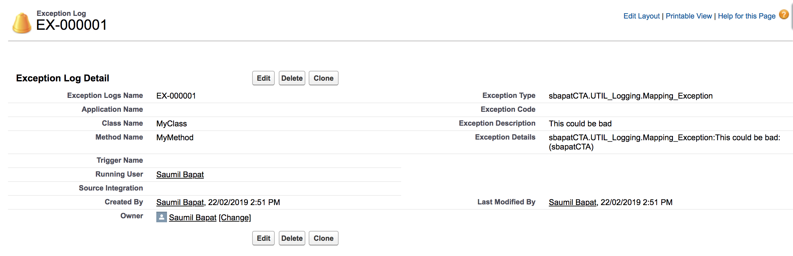
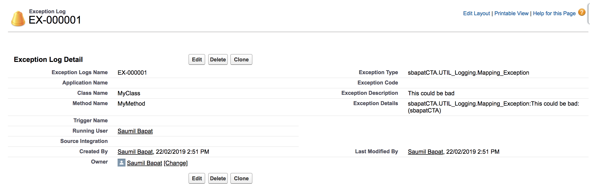
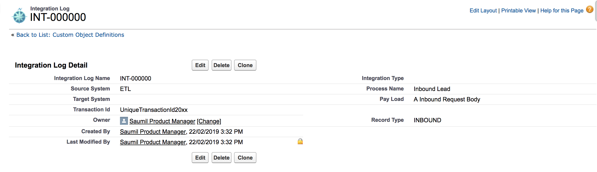

***Salesforce Application Logging Framework***

To promote reuse and provide a framework for handling common coding patterns, the team should use the following classes.  They will be created first and reused by the whole team.  Additions to the class functionality will be communicated to the wider team.

In order to use the ApplicationLog class there are 3 things you have to do

1. Deploy the package into your org
2. Populate the Custom Settings 'Exception Logging' & 'Integration Logging'
3. Schedule the class PurgeLogScheduler to run daily in your org
4. Modify your system admin profiles to give view permission to the tabs *Integration Logs* & *Exception Logs*

| **Artefact** | **Purpose** |
| --- | --- |
| Custom Setting *Exception_Logging* | Setting to define which types of messages to store, how long to store them for, and character cap |
| Custom Object *Exception_Log* | Object to hold custom exception messages |
| Custom Setting *Integration_Logging* | Setting to define if integration logging is enabled, how long to store them for, and payload stored cap |
| Custom Object *Integration_Log* | Object to hold custom integration messages |

**How Exception Logging Works**

- You use the overloaded constructor *ExceptionLog* in the class *UTIL_Logging* to create a exceptionLog instance by passing in:
    1. The Apex Exception or Database.UpsertResult
    2. Class name
    3. Method name
    4. Trigger name (optional)
    5. Message severity
- The *ExceptionLog* class has an overloaded method *LogMessage* that you can pass 1 or more exceptionLog instances
- Triggers can build up a collection of wrapper objects and pass them
- The utility class checks against the Exception_Logging__c custom setting to see if the type of message should be logged based on their current values allowing support staff to turn on/off debug levels
- Scheduled nightly batch job to purge records older than x days (from custom setting)

try {
  throw new MyException('some bad stuff just happened');
}
catch(MyException e) {
  UTIL_Logging.ExceptionLog ex = new UTIL_Logging.ExceptionLog(ex, 'MyClass', 'MyMethod', '', UTIL_Logging.DEBUG_LEVEL_ERROR);
  UTIL_Logging.logException(ex);
}

**Exception Logging Setting**

| **Field** | **Type** | **Required** | **Description** |
| --- | --- | --- | --- |
| Info | Picklist | Y | Error, Info, Warning, Debug |
| Warning | Picklist | Y | Error, Info, Warning, Debug |
| Debug | Picklist | Y | Error, Info, Warning, Debug |
| Error | Picklist | Y | Error, Info, Warning, Debug |
| Exception Description Max | Number (18) | N | Max length of exception description |
| Exception Details Max | Number (18) | N | Max length of exception details |
| Exception Logs Purge (Days) | Number (18) | N | How long to keep the exceptions logs in the system |
| Logging Enabled | Boolean | N | Is logging enabled |

**How Integration Logging Works**

- You use the method *createIntegrationLog* in class *UTIL_Logging* by passing the in the
  1. recordTypeId (optional integration record type)
  2. Payload
  3. Process Name
  4. Log Source
  5. Log Transaction Id
- The utility class checks against the Integration_Logging__c custom setting to see if the type of message should be logged based on their current values set and the max character limit to cap it at.

UTIL_Logging.createIntegrationLog('INBOUND', req.getBody(), 'Inbound Lead', 'ETL', 'UniqueTransactionId20xx');

**Integration Logging Setting**

| **Field** | **Type** | **Required** | **Description** |
| --- | --- | --- | --- |
| Pay Load Max | Number (18) | N | Max length of payload details to store |
| Integration Logs Purge Days | Number (18) | N | How long to keep the exceptions logs in the system |
| Logging Enabled | Boolean | N | Is logging enabled |

**Purge Application Log**

Requires two classes:
  1. Batchable class *PurgeLogs* to do the work
  2. Schedulable class *PurgeLogScheduler* to schedule the job

**Application Log User Interface**

*Exception Log - Warn*

try {
	throw UTIL_Logging.createMappingException('This could be bad');
} catch (Exception ex) {  
    UTIL_Logging.ExceptionLog exLog = new UTIL_Logging.ExceptionLog(ex, 'MyClass', 'MyMethod', '', UTIL_Logging.DEBUG_LEVEL_WARN);
  	UTIL_Logging.logException(exLog);
}

The screenshot below shows an example for information logged by the application that developers are responsible for unit testing as part of their test classes. In the example below the developer is logging information about an Apex batch job for auditing purposes.  They have included time taken for the job to run and some useful attributes for support.

*Exception Log - Error*

try {
	throw UTIL_Logging.createMappingException('This is bad');
} catch (Exception ex) {  
    UTIL_Logging.ExceptionLog exLog = new UTIL_Logging.ExceptionLog(ex, 'MyClass', 'MyMethod', '', UTIL_Logging.DEBUG_LEVEL_ERROR);
  	UTIL_Logging.logException(exLog);
}

The screenshot below shows an example for errors logged by the application that developers are responsible for unit testing as part of their test classes

*Integration Log*

HttpRequest req = new HttpRequest();
req.setbody('A Inbound Request Body');
UTIL_Logging.createIntegrationLog('INBOUND', req.getBody(), 'Inbound Lead', 'ETL', 'UniqueTransactionId20xx');

The screenshot below shows an example for errors logged by the application that developers are responsible for unit testing as part of their test classes

