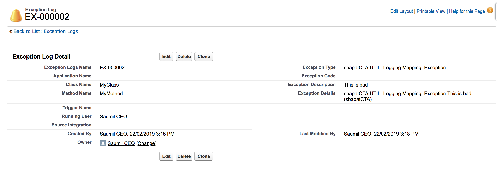

***Salesforce Application Logging Framework***

To promote good error handling practices reuse and provide a framework for handling common coding patterns, the team should use the following package.
此框架用以提高报错处理的水平，团队应该使用下面的开发包。

In order to use the framework there are 3 things you have to do
有3件事是你需要做的

1. Deploy the package into your org:  
   Installation Link: https://login.salesforce.com/packaging/installPackage.apexp?p0=04t2L000000RMJw
1. 部署这个包到你的org：
   安装链接： https://login.salesforce.com/packaging/installPackage.apexp?p0=04t2L000000RMJw
2. Populate the Custom Settings 'Exception Logging' & 'Integration Logging'
2. 配置自定义设置“Exception Logging”和“Integration Logging”
3. Schedule the class PurgeLogScheduler to run daily in your org
3. 每天在你的org里定时运行类PurgeLogScheduler
4. Modify your system admin profiles to give view permission to the tabs **Integration Logs** & **Exception Logs**
5. 修改管理员简档，使他有权限看到选项卡“Integration Logs”和“Exception Logs”

| **Artefact** | **Purpose** |
| --- | --- |
| Custom Setting *Exception_Logging* | Setting to define which types of messages to store, how long to store them for, and character cap |
| Custom Object *Exception_Log* | Object to hold custom exception messages |
| Custom Setting *Integration_Logging* | Setting to define if integration logging is enabled, how long to store them for, and payload stored cap |
| Custom Object *Integration_Log* | Object to hold custom integration messages |


| **组件** | **作用** |
| --- | --- |
| Custom Setting *Exception_Logging* | 设置哪些信息需要存储, 要存储多长时间以及字符上限 |
| Custom Object *Exception_Log* | 存储Exception信息的对象 |
| Custom Setting *Integration_Logging* | 设置是否启用集成日志,将它们存储多长时间以及有效载荷存储上限 |
| Custom Object *Integration_Log* | 存储集成信息的自定义对象 |

**How Exception Logging Works**
**异常日志如何工作**

- You use the overloaded constructor **ExceptionLog** in the class **UTIL_Logging** to create a exceptionLog instance by passing in
- 你可以在类UTIL_Logging里重载构造函数ExceptionLog，通过以下方式创建一个exceptionLog实例
    1. The Apex Exception or Database.UpsertResult
    1. Apex Exception或者Database.UpsertResult
    2. Class name
    2. 类名
    3. Method name
    3. 方法名
    4. Trigger name (optional)
    4. 触发器名（可选）
    5. Message severity
- The **ExceptionLog** class has two methods **LogMessage** & **LogMessages** that you can pass 1 or more exceptionLog instances
- ExceptionLog类有两个方法logException和logExceptions，你可以传递一个或多个exceptionLog
- Triggers can build up a collection of wrapper objects and pass them into **LogMessages** as a list
- 触发器可以创建一个包装类集合，以集合的方式传递到logExceptions
- The utility class checks against the Exception_Logging__c custom setting to see if the type of message should be logged based on their current values allowing support staff to turn on/off debug levels
- 公共类检查自定义设置Exception_Logging__c，来确定哪种类型的信息需要被记录
- Scheduled nightly batch job to purge records older than x days (governed by custom setting)
- 计划进行夜间批处理作业以清除x天之前的记录

**Exception Logging Setting**
**异常日志设置**

| **Field** | **Type** | **Required** | **Description** |
| --- | --- | --- | --- |
| Info | Picklist | Y | Log info level logs? |
| Warning | Picklist | Y | Log Warning level logs? |
| Debug | Picklist | Y | Log Debug level logs? |
| Error | Picklist | Y | Log Error level logs? |
| Exception Description Max | Number (18) | N | Max length of exception description |
| Exception Details Max | Number (18) | N | Max length of exception details |
| Exception Logs Purge (Days) | Number (18) | N | How long to keep the exceptions logs in the system |
| Logging Enabled | Boolean | N | Is logging enabled |

| **字段** | **类型** | **是否必填** | **描述** |
| --- | --- | --- | --- |
| Info | Picklist | Y | Log info level logs? |
| Warning | Picklist | Y | Log Warning level logs? |
| Debug | Picklist | Y | Log Debug level logs? |
| Error | Picklist | Y | Log Error level logs? |
| Exception Description Max | Number (18) | N | Max length of exception description |
| Exception Details Max | Number (18) | N | Max length of exception details |
| Exception Logs Purge (Days) | Number (18) | N | How long to keep the exceptions logs in the system |
| Logging Enabled | Boolean | N | Is logging enabled |

**How Integration Logging Works**
**集成日志如何工作**

- You use the method **createIntegrationLog** in class **UTIL_Logging** by passing the in the
- 你可以使用UTIL_Logging类的createIntegrationLog方法，传入如下参数
  1. recordTypeId (optional integration record type)
  1. 记录类型ID（可选）
  2. Payload
  3. Process Name
  4. Log Source
  4. 日志来源
  5. Log Transaction Id
  5. 日志事务ID
- The utility class checks against the Integration_Logging__c custom setting to see if the type of message should be logged based on their current values set and the max character limit to cap it at.
- 公共类检查自定义设置Integration_Logging__c，来判断是否那种类型的信息需要被记录及最大字符限制为

**Integration Logging Setting**
**集成日志设置**

| **字段** | **类型** | **是否必填** | **描述** |
| --- | --- | --- | --- |
| Pay Load Max | Number (18) | N | Max length of payload details to store |
| Integration Logs Purge Days | Number (18) | N | How long to keep the exceptions logs in the system |
| Logging Enabled | Boolean | N | Is logging enabled |

**清除应用程序日志**

Requires two classes:
需要两个类：
  1. Batchable class **PurgeLogs** to do the work
  1. 批处理类PurgeLogs工作
  2. Schedulable class **PurgeLogScheduler** to schedule the job
  2. Schedulable class **PurgeLogScheduler** 来计划任务


***应用程序日志界面***

**异常日志 - 警告**
```
try {
	throw UTIL_Logging.createMappingException('This could be bad');
} catch (Exception ex) {  
    UTIL_Logging.ExceptionLog exLog = new UTIL_Logging.ExceptionLog(ex, 'MyClass', 'MyMethod', '', UTIL_Logging.DEBUG_LEVEL_WARN);
  	UTIL_Logging.logException(exLog);
}
```


**异常日志 - 报错**
```
try {
	throw UTIL_Logging.createMappingException('This is bad');
} catch (Exception ex) {  
    UTIL_Logging.ExceptionLog exLog = new UTIL_Logging.ExceptionLog(ex, 'MyClass', 'MyMethod', '', UTIL_Logging.DEBUG_LEVEL_ERROR);
  	UTIL_Logging.logException(exLog);
}
```


**集成日志**
```
HttpRequest req = new HttpRequest();
req.setbody('A Inbound Request Body');
UTIL_Logging.createIntegrationLog('INBOUND', req.getBody(), 'Inbound Lead', 'ETL', 'UniqueTransactionId20xx');
```

